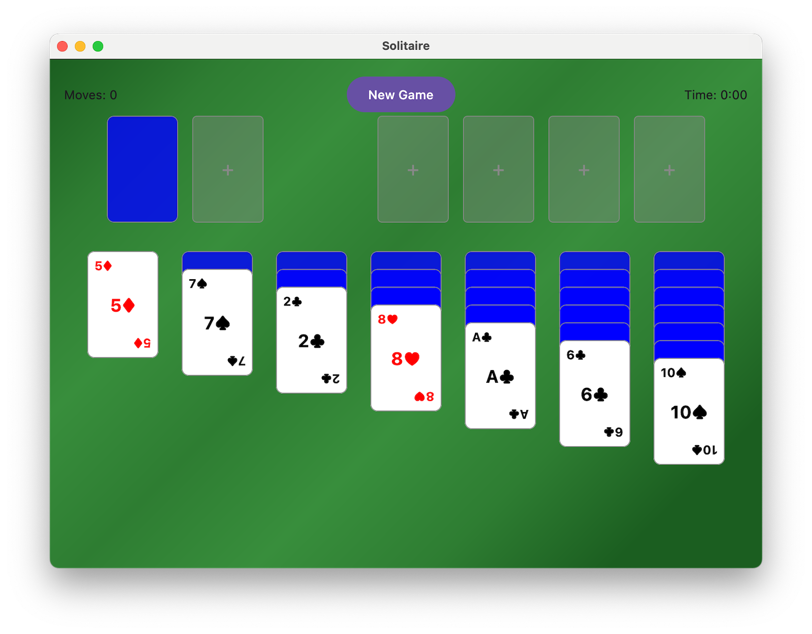

# Compose Solitaire

## Project Overview
Compose Solitaire is a modern implementation of the classic Solitaire card game using Jetpack Compose for Desktop. This project demonstrates how to build a desktop application using Kotlin and Compose Desktop framework.



## Technology Stack
- **Language**: Kotlin
- **UI Framework**: [Compose Multiplatform](https://www.jetbrains.com/compose-multiplatform/)

## Project Structure
```
compose-solitaire/
├── .junie/          # Project guidelines and documentation
├── .idea/           # IntelliJ IDEA configuration files
├── gradle/          # Gradle wrapper files
├── src/
│   └── main/
│       └── kotlin/  # Kotlin source files
├── build.gradle.kts # Gradle build configuration
├── settings.gradle.kts # Gradle settings
└── gradle.properties # Gradle properties
```

## Setup Instructions
1. **Prerequisites**:
   - JDK 11 or later
   - IntelliJ IDEA (recommended) or another IDE with Kotlin support

2. **Building the Project**:
   - Clone the repository
   - Open the project in IntelliJ IDEA
   - Let Gradle sync and download dependencies
   - Run the project using the 'desktop' run configuration

3. **Development**:
   - Main application entry point is in `src/main/kotlin/Main.kt`
   - The project uses Compose Desktop for UI components
   - Gradle is configured with Kotlin DSL for better IDE support

## Game Rules and Implementation Details

### Game Overview
Klondike Solitaire is a classic single-player card game where the objective is to sort all cards into foundation piles by suit and rank, from Ace to King.

### Game Components
1. **Standard Deck**: 52 cards (no Jokers)
2. **Game Areas**:
   - Tableau: 7 columns of cards
   - Stock Pile: Remaining deck face down
   - Waste Pile: Drawn cards face up
   - Foundation Piles: 4 piles for building up suits

### Initial Setup
- **Tableau**: 7 columns dealt as follows:
  - Column 1: 1 card face up
  - Column 2: 2 cards (1 face up, 1 face down)
  - Column 3: 3 cards (1 face up, 2 face down)
  - Column 4: 4 cards (1 face up, 3 face down)
  - Column 5: 5 cards (1 face up, 4 face down)
  - Column 6: 6 cards (1 face up, 5 face down)
  - Column 7: 7 cards (1 face up, 6 face down)
- **Stock Pile**: Remaining 24 cards face down

### Game Rules
1. **Foundation Building**:
   - Start with Aces
   - Build up by suit (♠️, ♥️, ♣️, ♦️)
   - Sequence: A → 2 → 3 → ... → K

2. **Tableau Rules**:
   - Build down in alternating colors
   - Move single cards or groups of cards
   - Empty columns can only be filled with Kings
   - Automatically flip face-down cards when exposed

3. **Stock and Waste Pile**:
   - Draw cards from stock to waste
   - Only top waste card is playable
   - Recycle waste pile when stock is empty

### Special Features
1. **Double-Click Automation**:
   - Double-clicking a card automatically moves it to the first valid position
   - Foundation placement takes priority over tableau moves

2. **Game Statistics**:
   - Move counter tracks the number of moves
   - Timer shows elapsed game time

### Winning Condition
The game is won when all cards are moved to the foundation piles in proper sequence (Ace to King) by suit.

### Implementation Details
- Built using Jetpack Compose for Desktop
- Implements drag-and-drop functionality for card movement
- Features smooth animations for card movements
- Includes undo/redo functionality
- Saves game state for resume capability

## Additional Notes
- The game includes visual and audio feedback for moves
- Auto-save feature preserves game progress
- High scores and statistics are locally stored
- Supports keyboard shortcuts for common actions